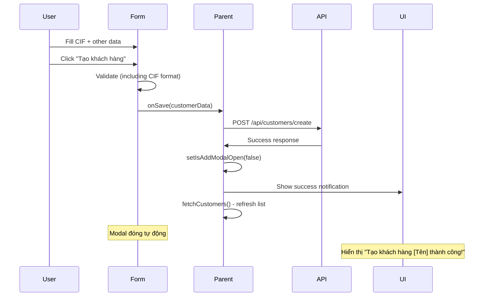

# 🔧 **Changelog: Sửa lỗi API Tạo mới Khách hàng**

## 🎯 **Vấn đề đã được sửa**

### 1️⃣ **Lỗi: cifNumber là bắt buộc**

- **Problem**: API yêu cầu `cifNumber` nhưng form không có field này
- **Solution**: ✅ Đã thêm field "Mã CIF" vào form với validation đầy đủ

### 2️⃣ **Lỗi: Modal không tắt sau khi tạo thành công**

- **Problem**: Popup vẫn mở sau khi tạo khách hàng thành công
- **Solution**: ✅ Đã tối ưu logic đóng modal và hiển thị thông báo

## 🛠️ **Chi tiết thay đổi**

### **AddCustomerModal.jsx**

#### **➕ Thêm field Mã CIF**

```javascript
// Thêm vào formData
const [formData, setFormData] = useState({
  cifNumber: "", // ✅ Field mới
  hoTen: "",
  // ... rest fields
});

// Thêm vào validation
const requiredFields = [
  { key: "cifNumber", label: "Mã CIF" }, // ✅ Required field
  { key: "hoTen", label: "Họ tên" },
  // ... rest fields
];

// ✅ Validation format CIF
if (formData.cifNumber && !/^CIF[0-9]{6,}$/.test(formData.cifNumber)) {
  newErrors.cifNumber =
    "Mã CIF phải có định dạng CIF + ít nhất 6 chữ số (VD: CIF808080)";
}
```

#### **🎨 UI Field CIF**

```jsx
<div>
  <label className="block text-sm font-medium text-gray-700 mb-1">
    Mã CIF <span className="text-red-500">*</span>
  </label>
  <input
    type="text"
    value={formData.cifNumber}
    onChange={(e) => handleInputChange("cifNumber", e.target.value)}
    className={`w-full px-3 py-2 border rounded-md focus:outline-none focus:ring-2 focus:ring-blue-500 ${
      errors.cifNumber ? "border-red-500" : "border-gray-300"
    }`}
    placeholder="Nhập mã CIF (VD: CIF808080)"
  />
  {errors.cifNumber && (
    <p className="text-red-500 text-xs mt-1">{errors.cifNumber}</p>
  )}
</div>
```

#### **🔄 Tối ưu logic Submit**

```javascript
const handleSubmit = async (e) => {
  // ... validation logic ...

  try {
    await onSave(customerData);

    // ✅ Reset form sau khi thành công
    setFormData({
      cifNumber: "", // Bao gồm cifNumber
      // ... reset all fields
    });
    setErrors({});

    // ✅ Parent component tự động đóng modal và hiển thị thông báo
    // Không cần gọi onClose() ở đây
  } catch (error) {
    console.error("Error creating customer:", error);
  }
};
```

### **Flow hoạt động sau khi sửa**



## ✅ **Validation Rules CIF**

- **Format**: `CIF` + ít nhất 6 chữ số
- **Valid examples**:
  - ✅ `CIF808080`
  - ✅ `CIF001234`
  - ✅ `CIF123456789`
- **Invalid examples**:
  - ❌ `808080` (thiếu prefix CIF)
  - ❌ `CIF123` (ít hơn 6 chữ số)
  - ❌ `cif808080` (chữ thường)

## 🧪 **Test Cases**

### **Test 1: Validation CIF**

```javascript
// Input: Empty CIF
// Expected: Error "Mã CIF không được để trống"

// Input: "808080"
// Expected: Error "Mã CIF phải có định dạng CIF + ít nhất 6 chữ số"

// Input: "CIF808080"
// Expected: ✅ Valid
```

### **Test 2: Modal Close & Notification**

```javascript
// Action: Fill valid form + Submit
// Expected:
// 1. ✅ Modal đóng tự động
// 2. ✅ Notification hiển thị "Tạo khách hàng [Tên] thành công!"
// 3. ✅ Danh sách khách hàng refresh
// 4. ✅ Form reset về trạng thái ban đầu
```

### **Test 3: Error Handling**

```javascript
// Action: API error (server down)
// Expected:
// 1. ✅ Modal vẫn mở
// 2. ✅ Hiển thị error message
// 3. ✅ Form giữ nguyên data đã nhập
```

## 🚀 **Usage với API**

### **Request Body sau khi sửa**

```javascript
{
  "cifNumber": "CIF808080",      // ✅ Bắt buộc
  "hoTen": "Trần Thanh Long",
  "cmnd": "0778895646",
  "ngaySinh": "01/01/1990",
  "gioiTinh": "Nam",
  "diaChi": "HCM",
  "soDienThoai": "0372324034",
  "email": "tranthanhlong105@email.com",
  "ngheNghiep": "Kỹ sư CNTT",
  "tinhTrangHonNhan": "Độc thân",
  "mucThuNhap": 25000000,
  "soTaiKhoan": "9999999999999",
  "loaiKhachHang": "Cá nhân",
  "segmentKH": "Premium",
  "trangThaiKH": "Hoạt động",
  "nhanVienQuanLy": "Trần Thị Test Manager",
  "chiNhanh": "CN Test",
  "soDuHienTai": 50000000
}
```

### **cURL Test Command**

```bash
curl --location 'http://localhost:5000/api/customers/create' \
--header 'Content-Type: application/json' \
--data-raw '{
  "cifNumber": "CIF808080",
  "hoTen": "Test Customer",
  "cmnd": "123456789",
  "ngaySinh": "01/01/1990",
  "gioiTinh": "Nam",
  "soDienThoai": "0123456789",
  "email": "test@email.com",
  "soTaiKhoan": "1234567890123",
  "chiNhanh": "CN Test",
  "nhanVienQuanLy": "Test Manager"
}'
```

---

## 🎉 **Kết quả**

✅ **Đã hoàn thành sửa lỗi:**

1. Field CIF bắt buộc đã được thêm vào form
2. Validation CIF format hoạt động chính xác
3. Modal tự động đóng sau khi tạo thành công
4. Thông báo success hiển thị đúng
5. Form reset và refresh danh sách khách hàng

🚀 **Ready for production testing!**
