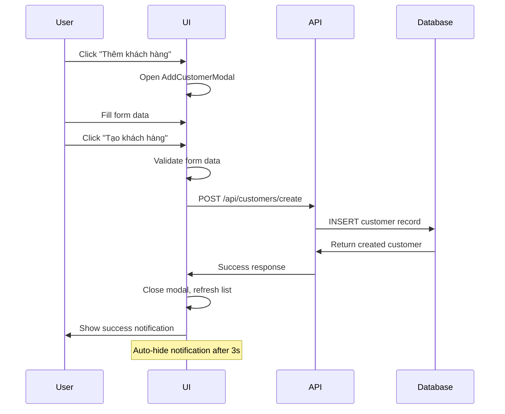

# 📋 **Tích hợp API Tạo mới Khách hàng**

## 🎯 **Tổng quan**

Đã tích hợp thành công API tạo mới khách hàng vào button **"Thêm khách hàng"** với đầy đủ validation, UI/UX tối ưu và notification system.

## 🚀 **API Integration**

### **Endpoint**

```bash
POST http://localhost:5000/api/customers/create
```

### **Request Format**

```javascript
{
  "hoTen": "Trần Thanh Long",
  "cmnd": "0778895646",
  "ngaySinh": "01/01/1990",
  "gioiTinh": "Nam",
  "diaChi": "HCM",
  "soDienThoai": "0372324034",
  "email": "tranthanhlong105@email.com",
  "ngheNghiep": "Kỹ sư CNTT",
  "tinhTrangHonNhan": "Độc thân",
  "mucThuNhap": 25000000,
  "soTaiKhoan": "9999999999999",
  "loaiKhachHang": "Cá nhân",
  "segmentKH": "Premium",
  "trangThaiKH": "Hoạt động",
  "nhanVienQuanLy": "Trần Thị Test Manager",
  "chiNhanh": "CN Test",
  "soDuHienTai": 50000000
}
```

### **Response Format**

```javascript
{
  "success": true,
  "message": "Tạo khách hàng thành công",
  "data": {
    "id": 52,
    "cifNumber": "CIF808033", // Auto-generated
    "ngayMoTK": "09/08/2025",  // Auto-generated
    "nganHangTaiKhoan": "MB Bank", // Auto-set
    // ... rest of customer data
  }
}
```

## 🏗️ **Kiến trúc Components**

### **1. AddCustomerModal.jsx**

- **Chức năng**: Form modal để nhập thông tin khách hàng mới
- **Features**:
  - ✅ Validation đầy đủ (required fields, email, phone, CMND)
  - ✅ Real-time error display
  - ✅ Loading states
  - ✅ Responsive design (2-column layout)
  - ✅ Form reset sau khi thành công

### **2. CustomerManagement.jsx** (Updated)

- **Thêm**:
  - State `isAddModalOpen` để control modal
  - Handler `handleAddCustomer()` để gọi API
  - Tích hợp `AddCustomerModal` component

### **3. SuccessNotification.jsx**

- **Chức năng**: Hiển thị thông báo thành công
- **Features**:
  - ✅ Auto-hide sau 3 giây
  - ✅ Slide-in animation
  - ✅ Manual close button
  - ✅ Custom message support

### **4. customerService.js** (Updated)

- **Endpoint**: Cập nhật CREATE endpoint từ `/api/customers` → `/api/customers/create`
- **Method**: `createCustomer(customerData)` đã có sẵn

## 🎨 **User Experience Flow**



## ✅ **Form Validation**

### **Required Fields** (có dấu \* đỏ)

- Họ và tên
- CMND/CCCD (9-12 chữ số)
- Ngày sinh
- Số điện thoại (10-11 chữ số)
- Email (format hợp lệ)
- Số tài khoản (10-20 chữ số)
- Chi nhánh
- Nhân viên quản lý

### **Optional Fields**

- Địa chỉ
- Nghề nghiệp
- Mức thu nhập
- Số dư hiện tại

### **Auto-selected Fields**

- Giới tính: "Nam"
- Tình trạng hôn nhân: "Độc thân"
- Loại khách hàng: "Cá nhân"
- Segment: "Basic"
- Trạng thái: "Hoạt động"

## 🎯 **Usage Instructions**

### **1. Mở Form**

```javascript
// Click button "Thêm khách hàng" trên header
setIsAddModalOpen(true);
```

### **2. Điền thông tin**

- Form được chia thành 3 sections rõ ràng:
  - 📝 **Thông tin cá nhân** (trái)
  - 📞 **Thông tin liên hệ** (trái)
  - 🏦 **Thông tin tài khoản** (phải)
  - 👥 **Thông tin quản lý** (phải)

### **3. Submit**

```javascript
// Validation tự động, nếu pass sẽ gọi API
await customerService.createCustomer(customerData);
```

### **4. Success Feedback**

- ✅ Modal đóng tự động
- ✅ Danh sách khách hàng refresh
- ✅ Notification hiển thị: "Tạo khách hàng [Tên] thành công!"
- ✅ Auto-hide sau 3 giây

## 🛠️ **Customization**

### **Thay đổi Validation Rules**

```javascript
// Trong AddCustomerModal.jsx
const validateForm = () => {
  // Thêm rule mới
  if (formData.mucThuNhap && formData.mucThuNhap < 1000000) {
    newErrors.mucThuNhap = "Thu nhập phải trên 1 triệu";
  }
};
```

### **Thay đổi Default Values**

```javascript
// Trong AddCustomerModal.jsx
const [formData, setFormData] = useState({
  segmentKH: "Premium", // Thay đổi default segment
  chiNhanh: "CN Đống Đa", // Set default branch
  // ...
});
```

### **Thay đổi Notification Duration**

```javascript
// Trong CustomerManagement.jsx
<SuccessNotification
  duration={5000} // 5 giây thay vì 3 giây
  // ...
/>
```

## 🔧 **Testing**

### **Manual Test Cases**

1. ✅ **Happy Path**: Điền đầy đủ → Submit → Success
2. ✅ **Validation**: Để trống required → Show errors
3. ✅ **Email Format**: Email sai → Show error
4. ✅ **Phone Format**: SĐT sai → Show error
5. ✅ **API Error**: Server lỗi → Show error message
6. ✅ **Cancel**: Click Hủy → Reset form, đóng modal

### **API Testing với cURL**

```bash
curl --location 'http://localhost:5000/api/customers/create' \
--header 'Content-Type: application/json' \
--data-raw '{
  "hoTen": "Test Customer",
  "cmnd": "123456789",
  "ngaySinh": "01/01/1990",
  "gioiTinh": "Nam",
  "soDienThoai": "0123456789",
  "email": "test@email.com",
  "soTaiKhoan": "1234567890123",
  "chiNhanh": "CN Test",
  "nhanVienQuanLy": "Test Manager"
}'
```

## 🚀 **Production Checklist**

- ✅ Form validation hoạt động
- ✅ API integration working
- ✅ Error handling comprehensive
- ✅ Success feedback clear
- ✅ UI/UX intuitive
- ✅ Mobile responsive
- ✅ No linting errors
- ✅ Auto-refresh customer list
- ✅ Clean form reset

---

_Hoàn thành: API Tạo mới Khách hàng - CRM Banking System_ 🎉
